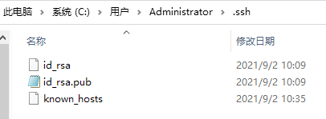
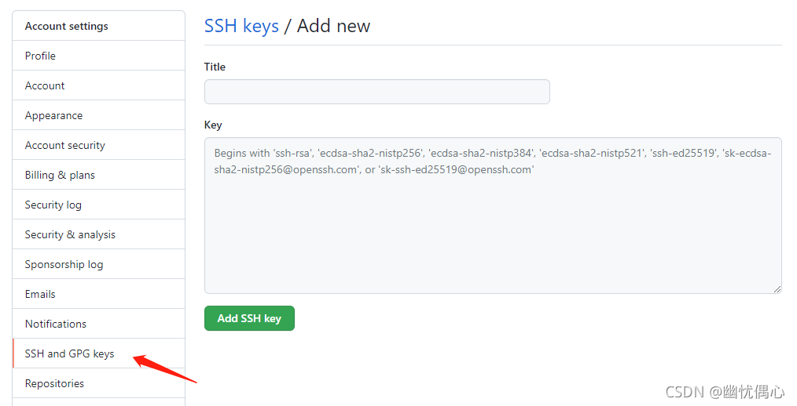
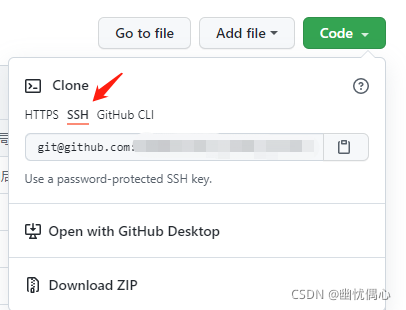

# Git的使用
- 关于git的一些使用操作介绍，如有补充，欢迎提出。
- 这部分内容主要覆盖GitHub的使用。
## 关于GitHub
- 由于在Gitee中讲述过Gitee了，本部分不在重复讲述。
- GitHub大体上与Gitee差不多，只是在一些细节上有所不同。


# 目录
[GitHub部分](#github部分)<br>
&emsp;&emsp;[Git配置代理网络](#git配置代理网络)<br>
&emsp;&emsp;[GitHub配置SSH]()<br>
&emsp;&emsp;[GitHub上传大文件](#github上传大文件)<br>
&emsp;&emsp;[将Gitee仓库转存到GitHub](#将gitee仓库转存到github)<br>
[]()<br>

# GitHub部分
## Git配置代理网络
### 对HTTP/HTTPS配置
- 问题：开启梯子的代理后 `pull` `push` `clone` 的速度依然很慢，只有10kb左右
- 原因：虽然开启了代理，但可能 git push 并没有走代理，因为需要在 git 里面进行配置。
- 解决：

    ***！！！梯子 一定要开全局模式！！！***
    ```
    git config --global http.proxy socks5://127.0.0.1:7890
    git config --global https.proxy socks5://127.0.0.1:7890
    ```

    其中`7890`为[Clash for Windows](https://okss.us/index.php#/dashboard)代理服务器在本机上的端口，具体端口号请查看自己代理的设置

    为了防止对gitee速度的影响，建议只对GitHub采用该规则：
    ```
    git config --global http.https://github.com.proxy socks5://127.0.0.1:7890
    git config --global https.https://github.com.proxy socks5://127.0.0.1:7890
    ```

    取消全局代理的设置：
    ```
    git config --global --unset http.proxy
    git config --global --unset https.proxy
    ```
    参考文章：<br>
    [为什么开了代理，git push 还是很慢或报错](https://blog.csdn.net/qq_42951560/article/details/124332605)<br>
    [解决git clone速度太慢的问题（SS socks5代理）](https://blog.csdn.net/qq_37409292/article/details/83005919)

### 对SSH配置


参考文章：<br>
[git 为ssh协议配置代理](https://blog.csdn.net/qq754772661/article/details/119924998)

## GitHub配置SSH
因为GitHub停用了Https的服务，现在只能使用ssh进行加密传输，所以需要配置电脑以使用SSH进行git的操作。

1. 新建ssh密钥<br>
    进入路径`C:\Users\Administrator`，在命令行输入如下命令，执行生成你的sshkey
    ```
    ssh-keygen -t rsa -C "这里换上你的邮箱"
    ```

    然后会生成如下文件：

    

2. GitHub关联ssh<br>
    进入GitHub的个人设置，找到`【SSH and GPG keys】`，然后点击`新增SSH`，进入如下界面<br>
    `title`输入你对于当前SSH key的备注<br>
    `key`就粘贴上一步生成的id_rsa.pub内的内容<br>

    

    然后就能开心的使用SSH模式操作git了。

3. 使用SSH<br>
    以GitHub为例，我们在查看code的时候如下图，使用SSH就好了

    

    如果是之前项目用的HTTPS，现在要改成SSH，进行上面的操作后，我们可以直接切换origin的地址
    ```
    git remote set-url origin 你的仓库sshURL
    ```

参考文章：<br>
[github使用ssh方式](https://blog.csdn.net/weixin_48349367/article/details/120056192)


## GitHub上传大文件
- 下载并安装 [git-lfs-windows-v3.3.0.exe](https://gitee.com/SMBU-POLARBEAR/knowledge_base/blob/master/OtherFiles/git-lfs-windows-v3.3.0.exe)
- 在根文件夹下写配置文件`.gitattributes`

参考文章：<br>

## 将Gitee仓库转存到GitHub
1. 在GitHub上创建一个空的远程仓库（***里面不能有任何东西***）
1. 在要转存的仓库中打开 git 终端
1. 输入以下指令来切断与原有远程仓库的连接。
    ```
    git remote remove origin
    ```
1. 输入以下指令来与新的远程仓库建立连接。（将`<remote-url>`替换为远程仓库地址）
    ```
    git remote add origin <remote-url>.git
    ```
1. 输入以下指令来更换主分支名
    ```
    git branch -M main
    ```
1. 输入以下指令将本地仓库推送到远程仓库
    ```
    git push -u origin main
    ```
- 如果速度很慢请参照[Git配置代理网络](#git配置代理网络)

参考文章：<br>


小企鹅 编辑于 2023.7.28