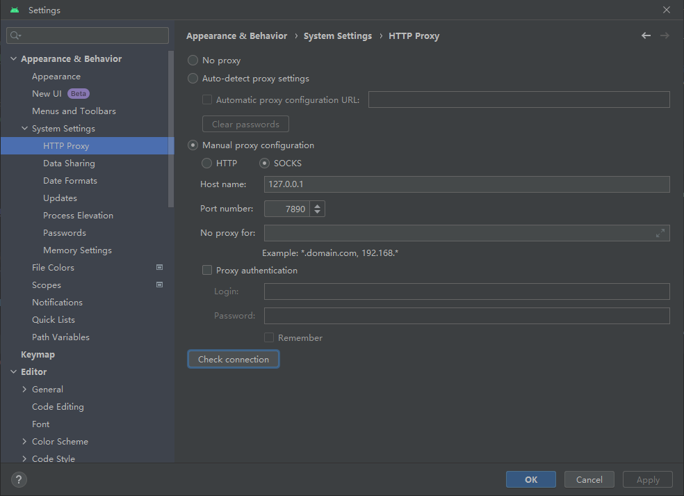
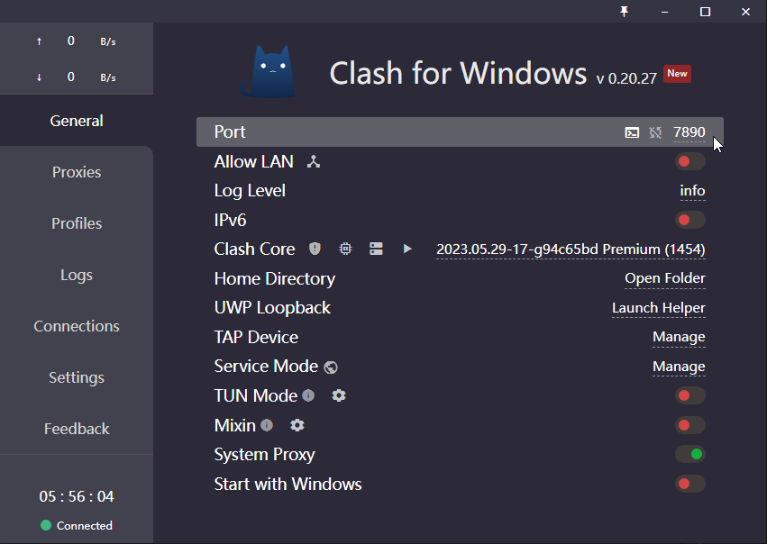

# 配置AndroidStudio

## 配置代理服务器
- 起因：在下载各种依赖项的时候我们经常要从外网上下载，如果我们没有配置好代理服务器的话就会导致下载很慢，甚至超时报错。
- 解决：
    1. 打开设置面板，搜索`proxy`，打开如下图的面板。

        

    2. 如上图，选择手动配置代理 
    选择`SOCKS` 
    `Host name`填主机ip:`127.0.0.1` 
    `Port`填代理在主机上的端口，如下图。

        

    3. 使用图中的 `Check connection` 输入一个外网网址检测连接是否正常。
